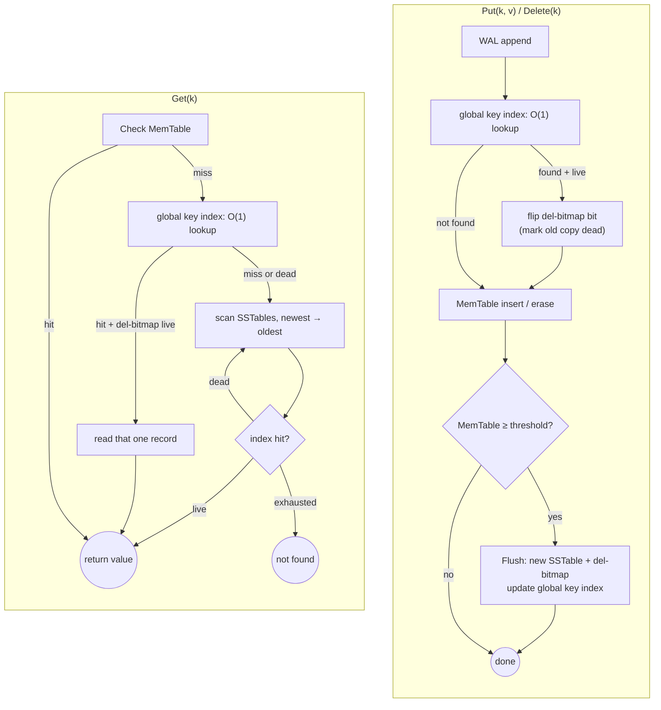
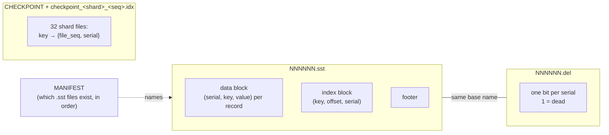
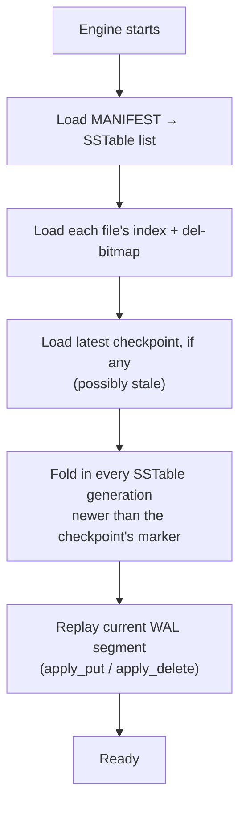
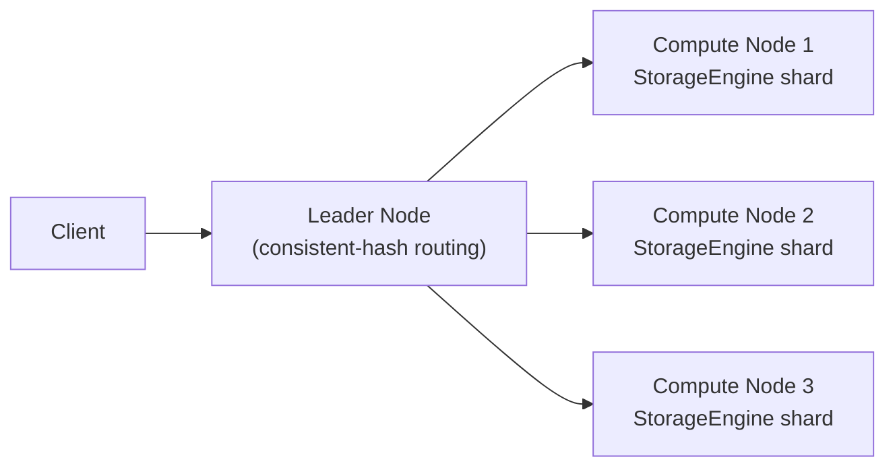

# LSM-Tree Key-Value Store

A persistent key-value storage engine built from scratch in C++, implementing a **Log-Structured
Merge-Tree (LSM-Tree)** — the design behind RocksDB, Cassandra, and similar systems. Every write
goes through a Write-Ahead Log and an in-memory table before flushing to immutable, indexed SSTable
files on disk; a background process reclaims space from overwritten and deleted keys without ever
blocking a reader. An optional distributed mode shards the same engine across multiple nodes behind
a consistent-hashing router.

## The numbers

Measured single-node, on this project's Oracle Cloud ARM64 VM, inside a Docker container capped at
**`--memory=4g --memory-swap=4g`** — a deliberately memory-constrained environment, not the VM's
full 31GB, so these numbers reflect a realistic constrained deployment (and match what a single
shard in the distributed cluster would actually have available) rather than a best-case number
inflated by everything fitting comfortably in RAM:

| | |
|---|---|
| **Reads** | **~6.4k RPS** |
| **Writes** | **~16.5k WPS** |
| **Deletes** | **~37k DPS** |
| **Mixed workload (interleaved reads/writes/deletes)** | **~6.7k ops/sec combined** — 50,000,000 ops in ~2.3 hours |

The first three rows: 3,000,000 writes → 300,000 deletes → 10,000,000 reads, values 512–4096B, 4
threads, background compaction on, cold page cache before the read phase. The mixed row: the same
seed data, then 50,000,000 reads / 5,000,000 writes / 1,000,000 deletes genuinely interleaved across
4 threads (not sequential phases) — a closer approximation of real traffic than any single-operation
phase, and the number that most directly reflects per-shard locking's actual payoff (see
[Performance](#performance)). These are the only throughput numbers this README presents — see
[Performance](#performance) for why, and how to reproduce them.

## What's implemented

**Storage engine — feature-complete for single-node use:**
- Write-ahead log, replayed on restart to recover anything not yet flushed.
- MemTable → SSTable flush once a size threshold is crossed.
- **Per-record serial numbers + del-bitmaps**, not tombstones. Every SSTable record carries its
  0-based position in that file; a companion `.del` file is a flat bit-per-record liveness map.
  Overwriting or deleting a key finds its current copy and flips that bit *immediately*, rather than
  writing a new tombstone record and waiting for compaction to notice the old copy is dead.
- **Sharded global key index.** An in-memory `key -> {file, serial}` map (32 hash-sharded buckets)
  turns lookups that used to scan every live SSTable generation into one O(1) hop, with a del-bitmap
  check before trusting any hit. Checkpointed to disk periodically so a restart doesn't have to
  rebuild it from scratch — the checkpoint is allowed to be stale; restart closes the gap by folding
  in whatever's newer and self-healing anything it finds already dead.
- **Per-shard locking.** The 32 index shards each have their own lock, plus a separate lock for the
  SSTable-level caches (index/del-bitmap/mmap/file list) independent of the memtable's own lock —
  replacing one engine-wide lock that made every `Put`/`Delete` block every concurrent `Get`, even
  for an unrelated key. Pays off specifically under real concurrent mixed access (measured: +45%
  combined throughput on the mixed workload above vs. the global index alone); a workload where every
  thread does the same single operation type at once doesn't have the same contention to relieve, and
  measured flat-to-slightly-worse there instead — the honest trade of finer-grained locking's per-call
  overhead against contention it doesn't get a chance to avoid.
- **Sharded memtable.** 8 independent shards, each its own lock, plus a small dedicated lock for the
  WAL pointer (decoupled from memtable sharding — there's exactly one active WAL segment regardless
  of shard count). Big win where it directly parallelizes concurrent writes: **+28% WPS** on a
  write-only phase, since different-key `Put`s now genuinely run concurrently instead of serializing
  on one lock. On the mixed workload specifically, a small measured *regression* instead (**-3.5%**
  combined ops/sec) — `Put` now sums sizes across all 8 shards to check the flush threshold, and that
  added per-write overhead outweighs the parallelism win once `Get`s are also competing for the same
  shard locks. A known, understood trade-off, not fixed blind — see [Performance](#performance).
- **Background compaction** — merges the two oldest SSTable generations at a time, holding no lock
  during the actual merge (only the final metadata swap is briefly exclusive), gated by a size-ratio
  check that bounds the cost of any one pass.
- **Manifest** — durably tracks which SSTable generations exist and in what order.
- **Opt-in LZ4 per-value compression.** Self-describing per-record (never block-level, so a lookup
  never decompresses more than the one record it asked for): a value that doesn't actually shrink
  falls back to raw storage rather than ever expanding a record on disk. Measured 0% reduction on
  this project's own uniform-random-byte benchmark values — expected, since LZ4 is a match-based
  compressor with no entropy-coding stage, and uniform random bytes have no matchable repeated
  sequences to find — versus **22.6% on realistic JSON payloads** (`--json-values`, see
  [Performance](#performance)), where repeated syntax and field names give it real structure to
  exploit.
- **133 engine-level tests**, all wired into CTest.

**Distributed cluster — core implemented and benchmarked:**
- Leader node routes `Put`/`Get`/`Delete` to one of several compute nodes via consistent hashing.
- Each compute node is an unmodified `StorageEngine` instance serving its own shard over a
  hand-rolled binary TCP protocol — no changes to the engine itself were needed to shard it.
- **43 cluster-layer tests** (hash ring, wire protocol, end-to-end integration).
- Not yet built: resize, virtual nodes, failover, replication (see [Roadmap](#roadmap)).

**Removed, deliberately:** Bloom filters (the standalone class and its tests still exist, just
unused by the engine — a del-bitmap check is now the only pre-read filter, and it's exact, not
probabilistic) and on-disk tombstone records (the del-bitmap bit *is* the durable record of a
delete now, so there's nothing left to write).

## Architecture

### Request flow



The global key index is only ever an accelerator, never authoritative on its own — a stale or
missing entry always falls back to the per-generation scan on the right, so a bug in the index can
degrade performance but can't produce a wrong answer.

### On-disk layout



### Restart / recovery



The checkpoint is deliberately allowed to lag reality. Step E closes the gap for keys that reached a
*newer* generation since the last checkpoint; a key that instead *died* since the checkpoint (a
delete, or an overwrite that never got its own flush) with no new generation to reveal that is
closed lazily instead — the same del-bitmap check every lookup already does catches it the first
time anything asks for that key, no eager repair pass needed.

### Distributed cluster



Each compute node owns its data exclusively — no replication yet, so losing a node's volume loses
that shard (see [Roadmap](#roadmap)).

## Performance

Why only three numbers, and why measured this way: earlier in this project, benchmarks run with the
OS page cache warm (or with the whole dataset comfortably fitting in unconstrained RAM) produced
throughput 8–100x higher than the same workload run cold and memory-constrained — numbers that
looked like an architectural win but were actually just measuring how much RAM happened to be free.
That mistake got made more than once. The numbers in this README are deliberately the *hard* ones:
single-node, inside a 4GB-capped container (matching a real compute-node shard's budget), with the
OS page cache dropped before the read phase — genuinely disk/cache-pressure-bound, not inflated.

Reproduce (writes/deletes/reads):
```bash
docker build --target kv_benchmark -t kv_benchmark .
docker run --memory=4g --memory-swap=4g -v "$(pwd)/data:/home/bench/vol" kv_benchmark \
  --writes=3000000 --deletes=300000 --reads=10000000 \
  --min-value-size=512 --max-value-size=4096 --memtable-threshold=100000 --threads=4 \
  --enable-compaction --data-dir=/home/bench/vol/data
```

Reproduce (mixed workload):
```bash
docker run --memory=4g --memory-swap=4g -v "$(pwd)/data:/home/bench/vol" kv_benchmark \
  --writes=3000000 --deletes=300000 \
  --mixed-reads=50000000 --mixed-writes=5000000 --mixed-deletes=1000000 \
  --min-value-size=512 --max-value-size=4096 --memtable-threshold=100000 --threads=4 \
  --enable-compaction --data-dir=/home/bench/vol/data
```

**Per-shard locking's payoff shows up specifically on the mixed workload, not the single-operation
phases.** Same 4GB-capped setup, global key index in both cases, only the locking model differs:

| | Global index alone | + Per-shard locking |
|---|---|---|
| Mixed workload | 4,803 ops/sec (~3.24h) | **6,965 ops/sec (~2.23h)** |
| Reads (standalone phase) | 6,307 RPS | 6,284 RPS |
| Deletes (standalone phase) | 45,448 DPS | 38,008 DPS |

The mixed phase interleaves Get/Put/Delete across 4 threads against different keys, which is exactly
where independent per-shard locks have contention to relieve — different threads' operations often
land on different shards and stop blocking each other, a 45% win. A standalone phase (every thread
doing the *same* operation type at once, e.g. all deleting) doesn't have that same contention to
begin with, so the extra lock acquisitions show up as pure overhead instead — flat on reads, worse on
deletes. Both are correctness-confirmed: identical or matching-to-the-4th-decimal observed miss rates
across every configuration.

Note: the global key index's on-disk *checkpointing* (`StartIndexCheckpointing`) isn't currently
wired into `kv_benchmark`'s CLI, so every number above measures the index's in-memory lookup
acceleration — real and what's actually on the hot path — but not checkpoint-write overhead, since
that thread was never started during these runs.

**LZ4 compression only does something on data that has structure to exploit.** This project's
default benchmark values are uniform random bytes — deliberately adversarial to any compressor (LZ4
is match-based, not entropy-coding, and uniform random bytes have essentially no matchable repeated
sequences), which is *why* it measured exactly **0% size reduction** there: two otherwise-identical
datasets, one compressed and one not, came out byte-for-byte identical on disk. `--json-values`
generates heterogeneous, randomly-structured JSON objects instead (3072-4096B each, no two alike) as
a realistic counterpart, and there compression actually has something to work with:

Reproduce (either benchmark above, with `--json-values --enable-value-compression` added):
```bash
docker run --memory=4g --memory-swap=4g -v "$(pwd)/data:/home/bench/vol" kv_benchmark \
  --writes=3000000 --deletes=300000 --reads=10000000 \
  --json-values --enable-value-compression --memtable-threshold=100000 --threads=4 \
  --enable-compaction --data-dir=/home/bench/vol/data
```

| | Random bytes, no compression | JSON + compression | Δ |
|---|---|---|---|
| On-disk dataset size (200K-write sample, exact byte count) | 1,452,329,271 | 1,123,791,624 | **-22.6%** |
| WPS | 12,863.5 | 12,132.6 | -5.7% |
| RPS | 6,284.0 | 6,319.85 | +0.6% (flat) |
| Mixed ops/sec | 6,965.08 | 6,875.46 | -1.3% (flat) |

Despite JSON values averaging 56% more raw bytes each (3,586B vs. 2,303B) than the random-byte
baseline, RPS and mixed throughput came out essentially unchanged — plausibly because the ~22.6%
on-disk footprint reduction offsets the larger logical value size, though this wasn't isolated
further. WPS dropped modestly, consistent with the added per-write compression-attempt cost. All
four configurations are correctness-confirmed: identical or matching-to-within-noise observed miss
rates throughout.

**Memtable sharding is the opposite pattern from index sharding: it wins big on a pure-write phase
and loses a little on the mixed workload.** Same 4GB-capped setup, random-byte values, only the
memtable's locking model differs from the "+ Per-shard locking" (index-only) row above:

| | Index sharding only | + Memtable sharding | Δ |
|---|---|---|---|
| WPS (standalone) | 12,863.5 | **16,482.3** | **+28.1%** |
| Mixed ops/sec | 6,965.08 | 6,721.92 | -3.5% |
| RPS (standalone) | 6,284.0 | 6,396.98 | +1.8% (flat) |

A write-only phase is exactly what memtable sharding targets: different-key `Put`s hashing to
different shards now genuinely run concurrently instead of serializing on one lock, and there's no
competing read traffic to fight for those same shard locks — a clean 28% win. The mixed workload adds
that competing traffic back, and layers on a real cost index sharding didn't have: after every `Put`,
checking whether the memtable has crossed the flush threshold now means summing sizes across all 8
shards (one shard-lock acquisition each) instead of reading one already-locked `.size()`. That
overhead is small per call but happens on every write, and apparently outweighs the parallelism gain
once `Get`s are in the mix too. A cheaper flush-trigger (an atomic running total updated on
insert/erase, instead of re-summing) would likely recover this, deliberately not built in this pass —
it's exactly the shape of derived counter that caused a real bug in the per-shard-locking phase (see
that phase's notes), and this trade-off is small and well-understood enough not to be worth that risk
casually. All configurations correctness-confirmed: identical or matching-to-within-noise observed
miss rates.

## Getting Started

**Prerequisites:** CMake 3.15+, a C++17 compiler (GCC 9+), Docker + Compose v2. Targets Linux — the
distributed layer uses POSIX sockets directly.

```bash
# Build everything and run the test suite
cmake -S . -B build && cmake --build build -j
ctest --test-dir build --output-on-failure
```

This builds `kv_tests` (133 checks, including a concurrent Put/Delete/Get stress test), `kv_cluster_tests`
(43 checks), `kv_benchmark` (single-node throughput), and `cluster_benchmark` (distributed throughput).

```bash
# Single-node benchmark
./build/kv_benchmark --help

# Distributed cluster
docker compose up --build -d
./build/cluster_benchmark --writes=1000000 --reads=1000000
```

There's no interactive CLI — `StorageEngine` is used as an in-process library (see `src/main.cpp`)
or served over the network via `compute_node`/`leader_node`.

## Roadmap

- [x] WAL, MemTable, SSTable flush, Manifest
- [x] Per-record serial numbers + del-bitmap eager dead-marking (replacing tombstones)
- [x] Sharded global key index with periodic checkpointing
- [x] Background compaction (size-ratio-gated, lock-free merge)
- [x] Leader + compute-node distributed cluster, consistent hashing
- [x] Memory-constrained, cold-cache-controlled benchmarking methodology
- [x] Per-shard locking (index shards + a separate SSTable-caches lock, replacing one engine-wide
      lock) — +45% combined throughput on the mixed workload; measured neutral-to-worse on
      single-operation-type phases, an expected trade-off (see [Performance](#performance))
- [x] Value compression (LZ4, per-value, opt-in) — 0% reduction on this project's own adversarial
      random-byte benchmark values (expected, see [Performance](#performance)), 22.6% on realistic
      JSON payloads (`--json-values`, added alongside it specifically to give compression a fair,
      non-adversarial test)
- [x] Shard the memtable (8 shards + a dedicated WAL-pointer lock, replacing the single
      memtable-wide lock) — +28.1% WPS on a write-only phase; -3.5% on the mixed workload specifically
      (the per-write cross-shard threshold check's overhead outweighs the parallelism win once reads
      are competing for the same locks too) — a known, understood trade-off, see
      [Performance](#performance)
- [ ] Wire `StartIndexCheckpointing` into `kv_benchmark`'s CLI so checkpoint-write overhead is
      actually measured, not just the in-memory lookup path
- [ ] Cheaper memtable flush-trigger (an atomic running total instead of summing all 8 shards per
      `Put`) to recover the mixed-workload regression above — deliberately not built alongside the
      sharding itself to avoid reintroducing a derived-counter class of bug already hit once this
      session
- [ ] Size-tiered compaction (today's oldest-two-only strategy can permanently stall a pair once the
      size-ratio gate is crossed; the del-bitmap redesign removed the *technical* constraint that
      required oldest-two merging, but the scheduling policy itself hasn't been relaxed yet)
- [ ] Snapshots
- [ ] Cluster resize (dynamic add/remove of compute nodes)
- [ ] Virtual nodes (real load balance across a small node count)
- [ ] Failover (route around an unreachable compute node instead of failing loud)
- [ ] Replication (currently one copy per key — losing a node's volume loses that shard)
