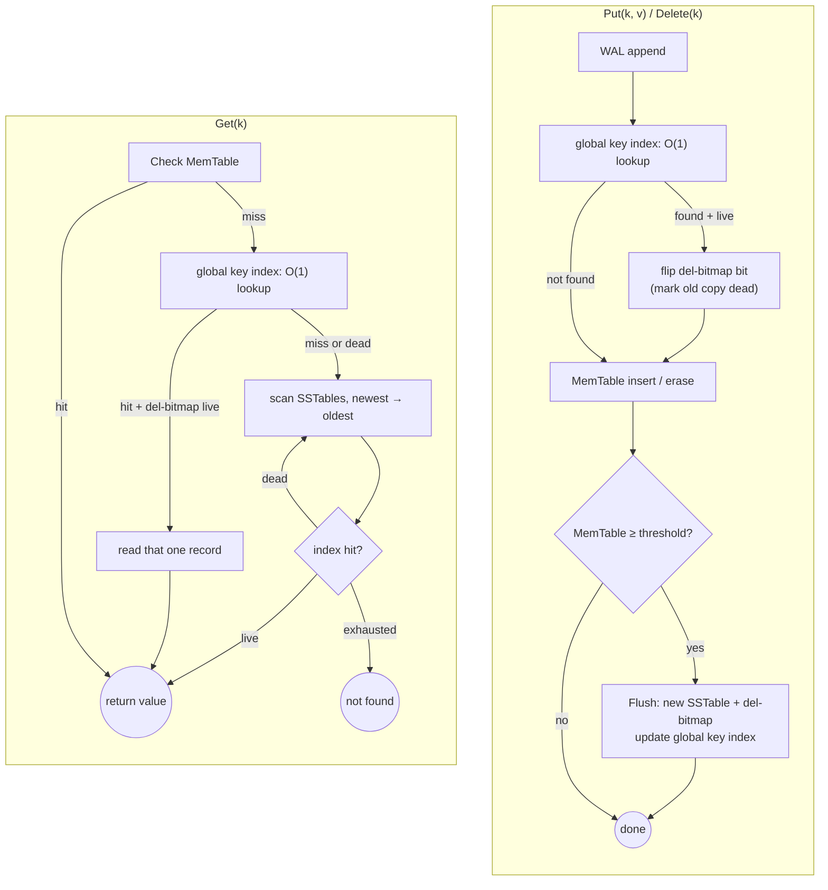
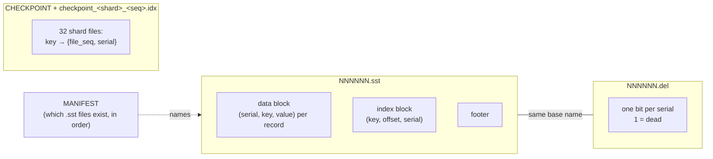
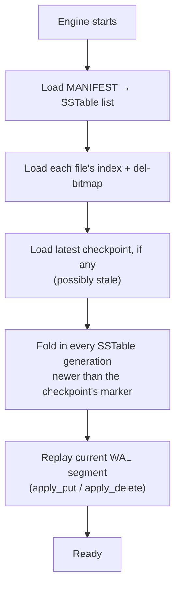
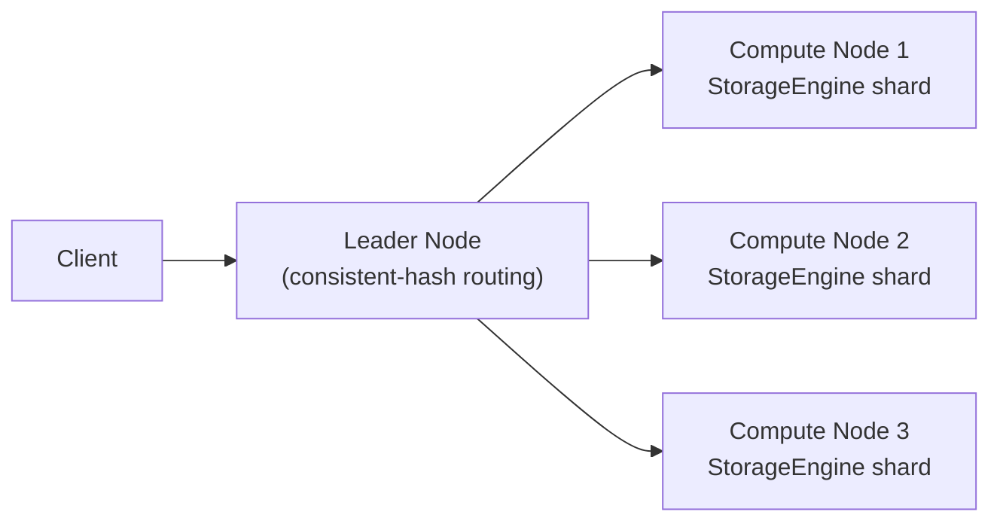

# LSM-Tree Key-Value Store

A persistent key-value storage engine built from scratch in C++, implementing a **Log-Structured
Merge-Tree (LSM-Tree)** — the design behind RocksDB, Cassandra, and similar systems. Every write
goes through a Write-Ahead Log and an in-memory table before flushing to immutable, indexed SSTable
files on disk; a background process reclaims space from overwritten and deleted keys without ever
blocking a reader. An optional distributed mode shards the same engine across multiple nodes behind
a consistent-hashing router.

## The numbers

Measured single-node, on this project's Oracle Cloud ARM64 VM, inside a Docker container capped at
**`--memory=4g --memory-swap=4g`** — a deliberately memory-constrained environment, not the VM's
full 31GB, so these numbers reflect a realistic constrained deployment (and match what a single
shard in the distributed cluster would actually have available) rather than a best-case number
inflated by everything fitting comfortably in RAM:

| | |
|---|---|
| **Reads** | **~6.3k RPS** |
| **Writes** | **~12.9k WPS** |
| **Deletes** | **~45k DPS** |

3,000,000 writes → 300,000 deletes → 10,000,000 reads, values 512–4096B, 4 threads, background
compaction on, cold page cache before the read phase. These are the only throughput numbers this
README presents — see [Performance](#performance) for why, and how to reproduce them.

## What's implemented

**Storage engine — feature-complete for single-node use:**
- Write-ahead log, replayed on restart to recover anything not yet flushed.
- MemTable → SSTable flush once a size threshold is crossed.
- **Per-record serial numbers + del-bitmaps**, not tombstones. Every SSTable record carries its
  0-based position in that file; a companion `.del` file is a flat bit-per-record liveness map.
  Overwriting or deleting a key finds its current copy and flips that bit *immediately*, rather than
  writing a new tombstone record and waiting for compaction to notice the old copy is dead.
- **Sharded global key index.** An in-memory `key -> {file, serial}` map (32 hash-sharded buckets)
  turns lookups that used to scan every live SSTable generation into one O(1) hop, with a del-bitmap
  check before trusting any hit. Checkpointed to disk periodically so a restart doesn't have to
  rebuild it from scratch — the checkpoint is allowed to be stale; restart closes the gap by folding
  in whatever's newer and self-healing anything it finds already dead.
- **Background compaction** — merges the two oldest SSTable generations at a time, holding no lock
  during the actual merge (only the final metadata swap is briefly exclusive), gated by a size-ratio
  check that bounds the cost of any one pass.
- **Manifest** — durably tracks which SSTable generations exist and in what order.
- **118 engine-level tests**, all wired into CTest.

**Distributed cluster — core implemented and benchmarked:**
- Leader node routes `Put`/`Get`/`Delete` to one of several compute nodes via consistent hashing.
- Each compute node is an unmodified `StorageEngine` instance serving its own shard over a
  hand-rolled binary TCP protocol — no changes to the engine itself were needed to shard it.
- **43 cluster-layer tests** (hash ring, wire protocol, end-to-end integration).
- Not yet built: resize, virtual nodes, failover, replication (see [Roadmap](#roadmap)).

**Removed, deliberately:** Bloom filters (the standalone class and its tests still exist, just
unused by the engine — a del-bitmap check is now the only pre-read filter, and it's exact, not
probabilistic) and on-disk tombstone records (the del-bitmap bit *is* the durable record of a
delete now, so there's nothing left to write).

## Architecture

### Request flow



The global key index is only ever an accelerator, never authoritative on its own — a stale or
missing entry always falls back to the per-generation scan on the right, so a bug in the index can
degrade performance but can't produce a wrong answer.

### On-disk layout



### Restart / recovery



The checkpoint is deliberately allowed to lag reality. Step E closes the gap for keys that reached a
*newer* generation since the last checkpoint; a key that instead *died* since the checkpoint (a
delete, or an overwrite that never got its own flush) with no new generation to reveal that is
closed lazily instead — the same del-bitmap check every lookup already does catches it the first
time anything asks for that key, no eager repair pass needed.

### Distributed cluster



Each compute node owns its data exclusively — no replication yet, so losing a node's volume loses
that shard (see [Roadmap](#roadmap)).

## Performance

Why only three numbers, and why measured this way: earlier in this project, benchmarks run with the
OS page cache warm (or with the whole dataset comfortably fitting in unconstrained RAM) produced
throughput 8–100x higher than the same workload run cold and memory-constrained — numbers that
looked like an architectural win but were actually just measuring how much RAM happened to be free.
That mistake got made more than once. The numbers in this README are deliberately the *hard* ones:
single-node, inside a 4GB-capped container (matching a real compute-node shard's budget), with the
OS page cache dropped before the read phase — genuinely disk/cache-pressure-bound, not inflated.

Reproduce (writes/deletes/reads):
```bash
docker build --target kv_benchmark -t kv_benchmark .
docker run --memory=4g --memory-swap=4g -v "$(pwd)/data:/home/bench/vol" kv_benchmark \
  --writes=3000000 --deletes=300000 --reads=10000000 \
  --min-value-size=512 --max-value-size=4096 --memtable-threshold=100000 --threads=4 \
  --enable-compaction --data-dir=/home/bench/vol/data
```

Note: the global key index's on-disk *checkpointing* (`StartIndexCheckpointing`) isn't currently
wired into `kv_benchmark`'s CLI, so the numbers above measure the index's in-memory lookup
acceleration — real and what's actually on the hot path — but not checkpoint-write overhead, since
that thread was never started during these runs.

## Getting Started

**Prerequisites:** CMake 3.15+, a C++17 compiler (GCC 9+), Docker + Compose v2. Targets Linux — the
distributed layer uses POSIX sockets directly.

```bash
# Build everything and run the test suite
cmake -S . -B build && cmake --build build -j
ctest --test-dir build --output-on-failure
```

This builds `kv_tests` (118 checks), `kv_cluster_tests` (43 checks), `kv_benchmark` (single-node
throughput), and `cluster_benchmark` (distributed throughput).

```bash
# Single-node benchmark
./build/kv_benchmark --help

# Distributed cluster
docker compose up --build -d
./build/cluster_benchmark --writes=1000000 --reads=1000000
```

There's no interactive CLI — `StorageEngine` is used as an in-process library (see `src/main.cpp`)
or served over the network via `compute_node`/`leader_node`.

## Roadmap

- [x] WAL, MemTable, SSTable flush, Manifest
- [x] Per-record serial numbers + del-bitmap eager dead-marking (replacing tombstones)
- [x] Sharded global key index with periodic checkpointing
- [x] Background compaction (size-ratio-gated, lock-free merge)
- [x] Leader + compute-node distributed cluster, consistent hashing
- [x] Memory-constrained, cold-cache-controlled benchmarking methodology
- [ ] Wire `StartIndexCheckpointing` into `kv_benchmark`'s CLI so checkpoint-write overhead is
      actually measured, not just the in-memory lookup path
- [ ] Per-shard locking for the global key index (the sharded structure is already in place; the
      rest of `StorageEngine` still serializes through one engine-wide lock)
- [ ] Size-tiered compaction (today's oldest-two-only strategy can permanently stall a pair once the
      size-ratio gate is crossed; the del-bitmap redesign removed the *technical* constraint that
      required oldest-two merging, but the scheduling policy itself hasn't been relaxed yet)
- [ ] Value compression (LZ4, per-value)
- [ ] Snapshots
- [ ] Cluster resize (dynamic add/remove of compute nodes)
- [ ] Virtual nodes (real load balance across a small node count)
- [ ] Failover (route around an unreachable compute node instead of failing loud)
- [ ] Replication (currently one copy per key — losing a node's volume loses that shard)
